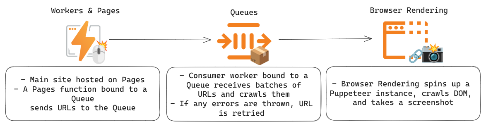

# Queues Web Crawler Example

An example use-case for [Queues](https://developers.cloudflare.com/queues/): a web crawler built on [Browser Rendering](https://developers.cloudflare.com/browser-rendering/) and Puppeteer. The crawler finds the number of links to Cloudflare.com on the site, and archives a screenshot to Workers KV.

For this project, Queues helps batch sites to be crawled, which limits the overhead of opening and closing new Puppeteer instances. Because loading pages and scraping links takes some time, Queues makes it possible to respond to inbound crawl requests instantly while providing peace of mind that the long-running crawl will be triggered. Queues also helps handle bursty traffic and reliability issues!

## Development

First, fork this project. Install [Node.js](https://nodejs.org/en/download) and [Wrangler](https://developers.cloudflare.com/workers/wrangler/install-and-update/), and run `npm install`.

Then, to configure your project and deploy on Cloudflare Workers:

1. Go to the [Dash](https://dash.cloudflare.com) and click on Workers & Pages > Queues > Create queue. Enter a Queue name.
2. In the `pages` directory, `wrangler pages deploy .`, and enter a project name (`PROJECT_NAME`).
3. Go to the [Dash](https://dash.cloudflare.com) and click on Workers & Pages > Overview > `PROJECT_NAME` > Settings > Functions > Queue Producers bindings > Add binding.
4. Set the variable name to `CRAWLER_QUEUE` and select your queue as the Queue name. Click "Save".
5. In the Dash, click on Workers & Pages > KV > Create a namespace. Create one namespace called `crawler_screenshots` and one called `crawler_links`.
6. Create two KV namespace bindings. Set `CRAWLER_LINKS_KV` as first's variable name and `crawler_links` as the KV namespace. Then, set `CRAWLER_SCREENSHOTS_KV` as the second's variable name and `crawler_screenshots` as the KV namespace.
7. In the `consumer` directory, update the `wrangler.toml` file with your new KV namespace IDs. Also update the `[[queues.consumers]]` name to the Queue you created.
8. In the `consumer` directory, `wrangler deploy`.

Your Queues-powered web crawler will be live!
